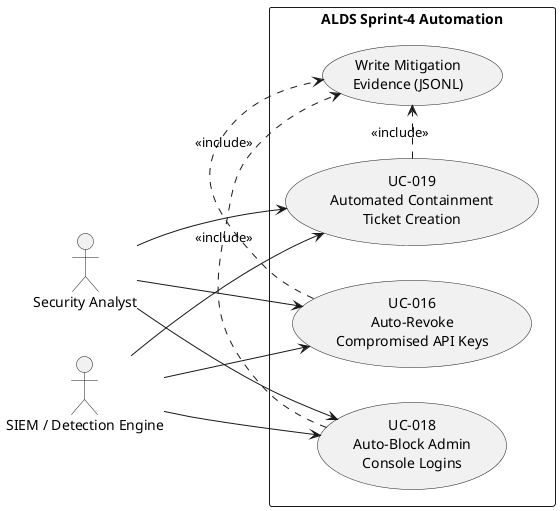
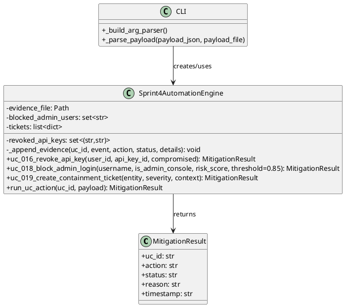
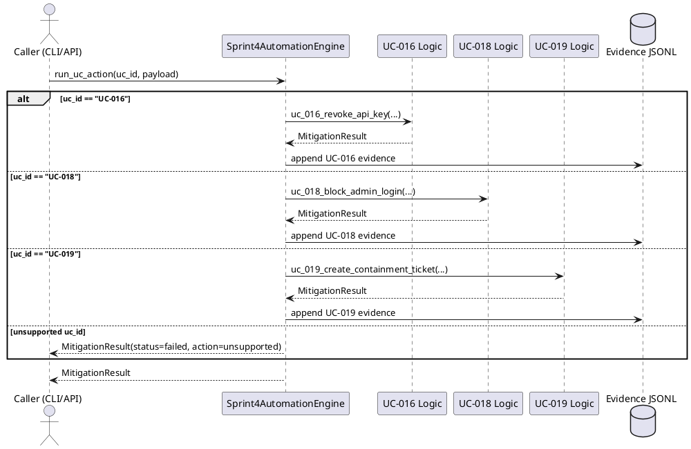

# Sprint-4 UML (PlantUML)

Note: If your PlantUML tool parses the whole Markdown file, it may fail on code fences (``` lines).
Use this raw file for direct rendering:
- `admin/sprint4_uml.puml`

## Use Case Diagram



## Class Diagram



## Sequence Diagram (UC Dispatcher)


